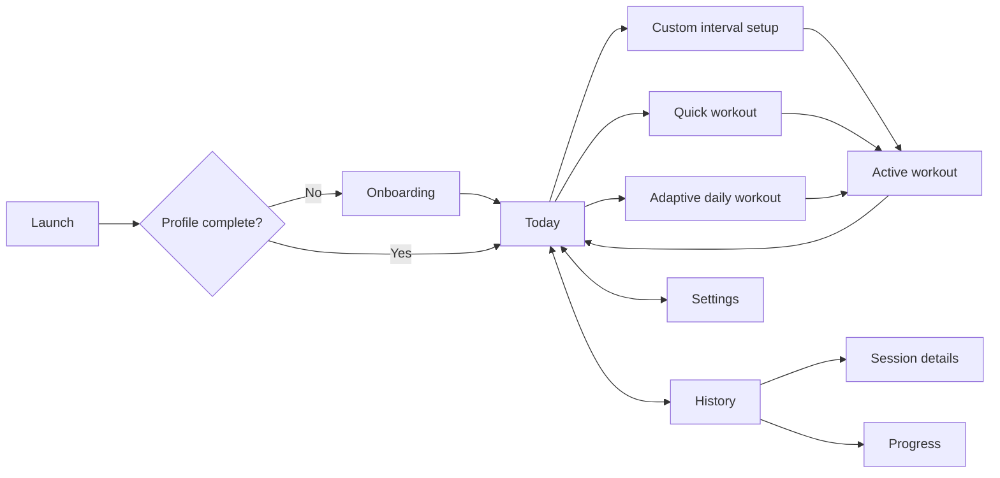
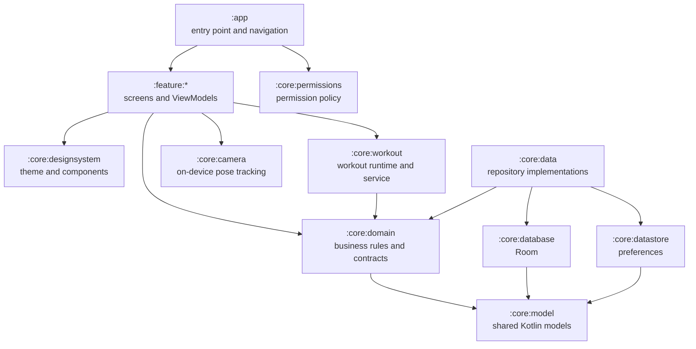

<div align="center">
  

# Jump

**A focused jump-rope training companion that adapts to your rhythm.**

[](https://developer.android.com/)
[](https://kotlinlang.org/)
[](https://developer.android.com/compose)
[](docs/architecture.md)
</div>

Jump is a native Android app for planning, tracking, and reviewing jump-rope workouts. It creates daily sessions from the athlete's experience, goal, and recent history; supports custom intervals; and counts jumps with either phone motion sensors or on-device camera pose detection.

> Jump is under active development. The current application ID and release configuration are development defaults.

## What you can do

- Build a training profile around experience, goals, and weekly frequency.
- Start a quick, adaptive daily, or fully configurable interval workout.
- Count jumps with pocket motion sensing or front-camera body tracking.
- Keep workouts alive through a foreground service with pause, resume, work/rest transitions, voice cues, tones, and vibration.
- Review session history, correct a detected jump count, or remove a session.
- Explore streaks, a 13-week activity calendar, weekly volume, active time, and estimated calories.
- Keep workout history and preferences locally with Room and DataStore.

Camera frames are analyzed in memory on the device. Jump does not record, persist, or upload them.

## Screens and flow



## Tech stack

| Area | Technology |
| --- | --- |
| UI | Kotlin, Jetpack Compose, Material 3 |
| Navigation | Navigation 3 with saveable state and destination-scoped ViewModels |
| State | MVVM, `StateFlow`, coroutines, unidirectional data flow |
| Dependency injection | Hilt and KSP |
| Persistence | Room for workout history; Preferences DataStore for profile and settings |
| Workout tracking | Android motion sensors, foreground service, text-to-speech, tones, vibration |
| Camera tracking | CameraX and ML Kit Pose Detection |
| Build | Gradle Kotlin DSL, version catalog, local convention plugins |
| Tests | JUnit, coroutine tests, Room tests, Compose UI tests |

## Architecture

The app is split by responsibility: feature modules own screens and ViewModels, domain modules hold business rules and contracts, and data modules hide persistence details behind repositories.



Read [the architecture guide](docs/architecture.md) for data flow, dependency rules, workout execution, and camera-counting details.

## Modules

Every Gradle module has a local README describing its responsibilities, public surface, dependencies, boundaries, and test command.

| Module | Responsibility |
| --- | --- |
| [`:app`](app/README.md) | Application entry point, onboarding gate, Navigation 3 graph, and runtime permission requests |
| [`:core:model`](core/model/README.md) | Platform-independent workout, profile, preference, and active-session models |
| [`:core:domain`](core/domain/README.md) | Repository contracts, adaptive planning, interval planning, calories, and progress analysis |
| [`:core:database`](core/database/README.md) | Room database, workout entities, DAO, and schema exports |
| [`:core:datastore`](core/datastore/README.md) | Profile, cue, counting-mode, and custom-workout preferences |
| [`:core:data`](core/data/README.md) | Repository implementations, persistence coordination, and model mappings |
| [`:core:designsystem`](core/designsystem/README.md) | Jump theme, reusable Compose components, navigation UI, and formatters |
| [`:core:workout`](core/workout/README.md) | Active-session state machine, motion counting, controller, and foreground service |
| [`:core:camera`](core/camera/README.md) | CameraX preview, ML Kit pose analysis, and camera jump detector |
| [`:core:permissions`](core/permissions/README.md) | SDK-aware workout permission policy and Android grant checks |
| [`:feature:onboarding`](feature/onboarding/README.md) | First-run training-profile setup |
| [`:feature:home`](feature/home/README.md) | Today dashboard, recommendations, workout launch, and weekly summary |
| [`:feature:workoutsetup`](feature/workoutsetup/README.md) | Custom interval-workout builder |
| [`:feature:workout`](feature/workout/README.md) | Live workout and completion experience |
| [`:feature:history`](feature/history/README.md) | Session list, details, correction, and deletion |
| [`:feature:progress`](feature/progress/README.md) | Streaks, training calendar, totals, and weekly activity chart |
| [`:feature:settings`](feature/settings/README.md) | Counting, coaching-cue, and profile settings |
| [`build-logic`](build-logic/README.md) | Shared Android, Compose, and JVM Gradle conventions |

## Getting started

### Requirements

- Android Studio with Android SDK 37.1 installed
- JDK 17 (the Gradle toolchain can resolve a compatible JDK)
- An emulator or device running Android 7.0 / API 24 or newer

### Build and run

```bash
git clone https://github.com/Ollez95/Jump.git
cd Jump
./gradlew assembleDebug
```

Open the project in Android Studio, select the `app` run configuration, and run it on an emulator or physical device. The debug APK is generated under `app/build/outputs/apk/debug/`.

### Permissions

Jump requests permissions only when the selected counting method needs them.

| Permission | Why it is used |
| --- | --- |
| Camera | Analyze body movement for camera-based jump counting |
| Physical activity | Read the device motion sensor for pocket counting on supported Android versions |
| Notifications | Show the ongoing workout notification on Android 13+ |
| Foreground service / health | Continue an active workout while the app is not in the foreground |
| Vibration | Deliver optional haptic workout cues |

If a permission is declined, the workout is not started with that counting mode and the home screen explains what is missing.

## Tests and checks

Run the local test suite:

```bash
./gradlew test
```

Run the connected Compose UI tests with an emulator or device available:

```bash
./gradlew connectedDebugAndroidTest
```

Build and lint the debug application before submitting a change:

```bash
./gradlew assembleDebug lint
```

Room schema snapshots live in `core/database/schemas/`. Commit an updated schema whenever the database version changes.

## Project conventions

- Features do not depend on other features; `:app` coordinates navigation.
- UI reads repository contracts from `:core:domain`, never Room or DataStore directly.
- Shared state is exposed as `Flow`/`StateFlow`; Compose collects it with lifecycle awareness.
- Long-running workout work belongs in `:core:workout`, not in a screen or Activity.
- Camera analysis belongs in `:core:camera`; timing and persistence stay shared through `WorkoutCoordinator`.
- Dependency versions are centralized in `gradle/libs.versions.toml`.

When adding a module, include it in `settings.gradle.kts`, use the appropriate convention plugin, keep dependency direction intact, and add its module README to the table above.

